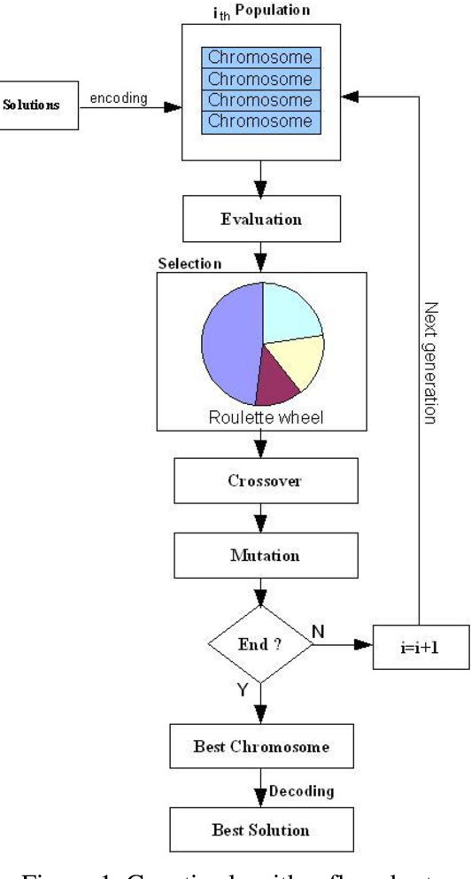
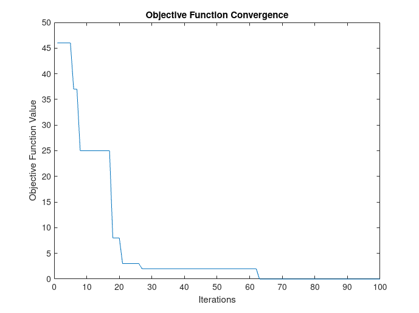

# Genetic-Algorithm-For-Solving-A-Mathematical-Equality-Problem

This repository contains an implementation of the genetic algorithm proposed in the paper titled "Genetic Algorithm for Solving Simple Mathematical Equality Problem". The algorithm aims to find solutions to a simple mathematical equality problem using a genetic algorithm approach.

## Flowchart

The genetic algorithm works as follows:

## Results

We plooted the objective function with time, and we can observe its convergence using the genetic algorithm.

